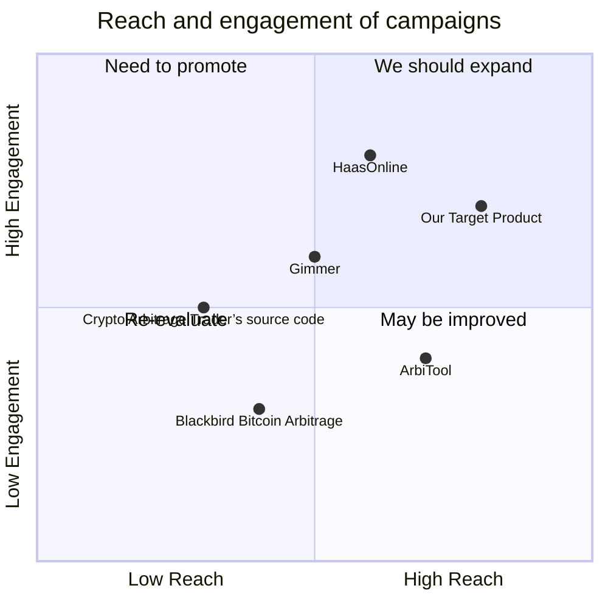

## Original Requirements
The boss has requested the creation of a bot in Python language that performs arbitrage between binance.com and bitfinex.com for the SOL token.

## Product Goals
```python
[
    "Create a Python bot that can identify arbitrage opportunities for the SOL token between Binance and Bitfinex",
    "Ensure the bot can execute trades on both platforms when an arbitrage opportunity is identified",
    "Ensure the bot operates efficiently and reliably"
]
```

## User Stories
```python
[
    "As a user, I want the bot to monitor the price of SOL token on both Binance and Bitfinex continuously",
    "As a user, I want the bot to identify when an arbitrage opportunity exists between the two platforms",
    "As a user, I want the bot to execute trades on my behalf when an arbitrage opportunity is identified",
    "As a user, I want to be notified when a trade has been executed",
    "As a user, I want the bot to operate reliably without requiring constant supervision"
]
```

## Competitive Analysis
```python
[
    "ArbiTool: A paid service that provides arbitrage opportunities between various exchanges. However, it does not execute trades on behalf of users.",
    "Arbitrage Bot by HaasOnline: A bot that supports numerous exchanges and cryptocurrencies. It is highly customizable but requires technical knowledge to set up and use.",
    "Blackbird Bitcoin Arbitrage: An open-source project on GitHub. It supports Bitcoin but does not support other cryptocurrencies like SOL.",
    "Gimmer: A bot platform that offers arbitrage bots. It supports multiple exchanges but requires users to rent or buy bots.",
    "Crypto Arbitrage Trader’s source code: An open-source project on GitHub. It supports multiple exchanges and cryptocurrencies but requires technical knowledge to set up and use."
]
```

## Competitive Quadrant Chart


## Requirement Analysis
The product should be a Python bot that continuously monitors the price of SOL token on Binance and Bitfinex. It should identify arbitrage opportunities and execute trades on both platforms when such opportunities are identified. The bot should operate reliably and notify the user when a trade has been executed.

## Requirement Pool
```python
[
    ("Monitor the price of SOL token on Binance and Bitfinex continuously", "P0"),
    ("Identify when an arbitrage opportunity exists between the two platforms", "P0"),
    ("Execute trades on both platforms when an arbitrage opportunity is identified", "P0"),
    ("Notify the user when a trade has been executed", "P1"),
    ("Operate reliably without requiring constant supervision", "P1")
]
```

## UI Design draft
The bot will be command-line based, with a clean and simple interface. It will display real-time price information of SOL token on both Binance and Bitfinex. When an arbitrage opportunity is identified, it will highlight the opportunity and execute the trade, showing a confirmation message upon successful execution. The bot will also provide a summary of its trading activity, including the number of trades executed and the profit/loss from each trade.

## Anything UNCLEAR
There are no unclear points.