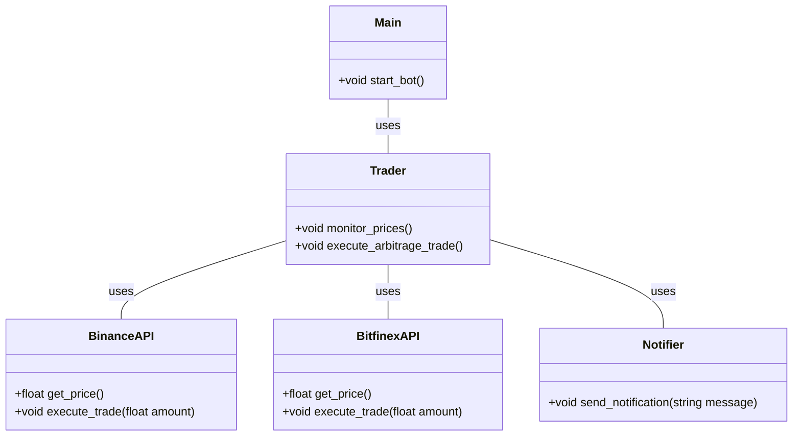
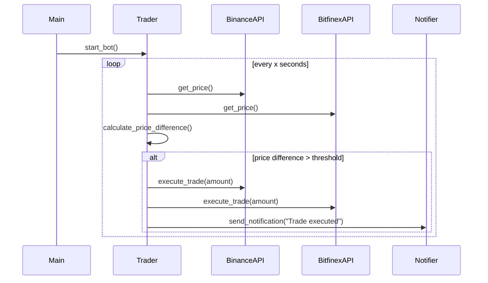

## Implementation approach
The bot will be implemented using Python and will make use of the following open-source libraries:

1. `requests`: For making HTTP requests to the Binance and Bitfinex APIs.
2. `ccxt`: A cryptocurrency trading library with support for more than 100 bitcoin/altcoin exchanges. It will be used to interact with the Binance and Bitfinex APIs for fetching price data and executing trades.
3. `apscheduler`: For scheduling tasks in Python. It will be used to continuously monitor the price of the SOL token on both exchanges.
4. `logging`: For logging the bot's activities and any errors that may occur.
5. `python-dotenv`: To manage API keys and other sensitive information.

The bot will continuously fetch the price of the SOL token on both exchanges and calculate the price difference. If the price difference exceeds a certain threshold (which can be set by the user), the bot will execute trades on both platforms to take advantage of the arbitrage opportunity. The bot will also log its activities and send notifications to the user when a trade has been executed.

## Python package name
```python
"arbitrage_bot"
```

## File list
```python
[
    "main.py",
    "binance_api.py",
    "bitfinex_api.py",
    "trader.py",
    "notifier.py",
    ".env"
]
```

## Data structures and interface definitions


## Program call flow


## Anything UNCLEAR
The requirement is clear. However, the actual implementation may require handling additional complexities such as handling API rate limits, error handling, and ensuring secure management of API keys.